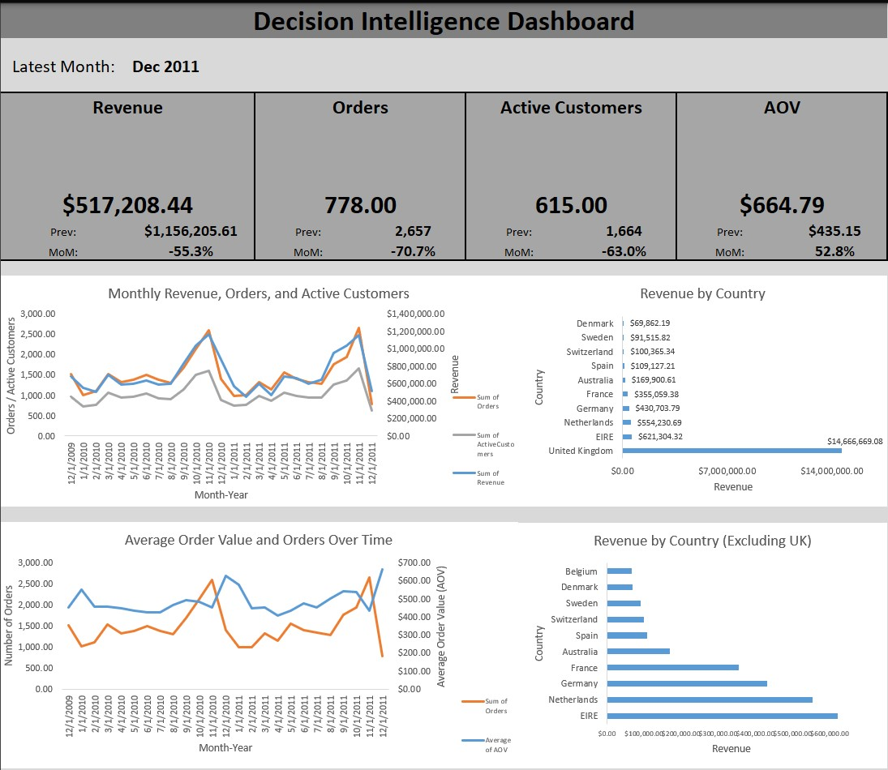
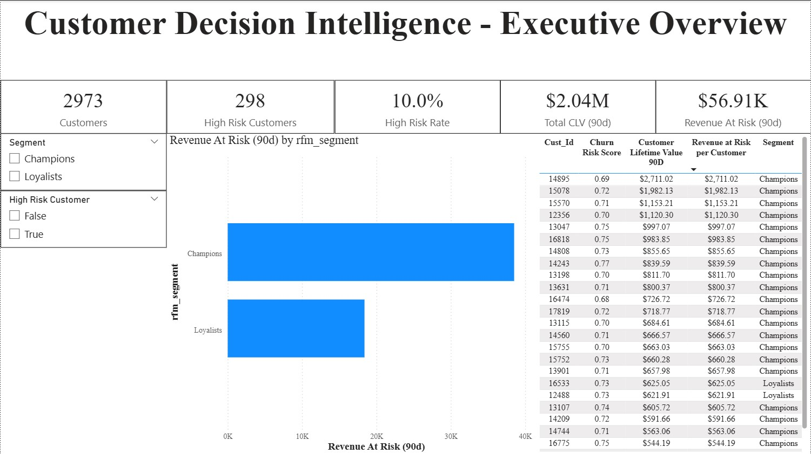
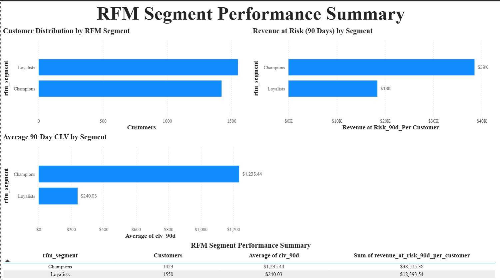
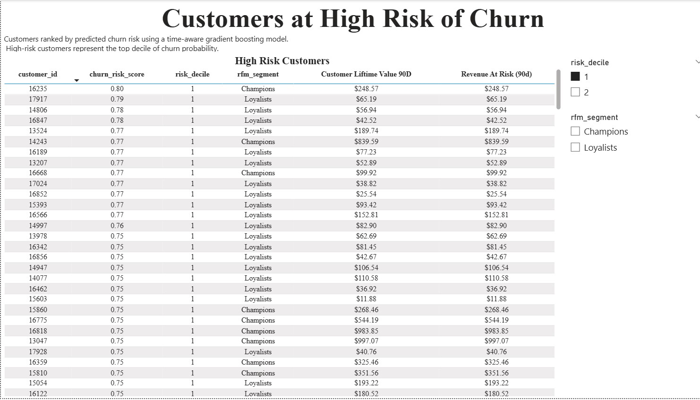
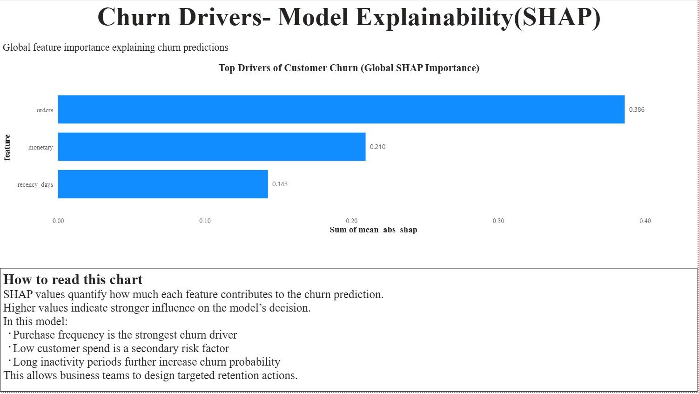

# Business Decision Intelligence for Customer Analytics

Business decisions around growth, retention, and revenue are often driven by spreadsheets, ad-hoc SQL queries, and static dashboards. While these tools are familiar, they frequently lack a clear analytical pipeline connecting raw transactions to actionable decisions.

This project builds an **end-to-end decision intelligence system** on top of real transactional data, progressing from spreadsheet-based KPIs to database-driven analytics, customer segmentation, probabilistic lifetime value modeling, and machine-learning-based churn risk estimation.

The emphasis is on **interpretability, reproducibility, and business relevance**. All metrics are traceable to transactional data, models are explainable, and outputs are designed to support real decision-making rather than experimental modeling.

---

## Dataset

The project uses the **Online Retail II** dataset from the UCI Machine Learning Repository.

- Time range: **December 2009 – December 2011**
- Total transactions: **805,549**
- Distinct customers: **5,878**
- Fields include invoice identifiers, quantities, prices, timestamps, customer IDs, and country

Multiple yearly sheets (2009–2010 and 2010–2011) were combined into a single analytical dataset prior to downstream processing.

---

## Data Processing and Storage

Raw transactional data was cleaned and standardized using Python, then loaded into **PostgreSQL** as the system of record.

### Cleaning rules applied
- Removed cancelled invoices (invoice numbers starting with `"C"`)
- Removed rows with non-positive quantities or unit prices
- Removed records with missing customer identifiers
- Parsed invoice timestamps into a consistent datetime format
- Dropped exact duplicate rows after combining multiple sheets

The cleaned dataset was stored in PostgreSQL and used as the foundation for all analytical views and models.

---

## Analytics Layer (PostgreSQL)

A dedicated analytics schema was built in PostgreSQL to support reproducible feature engineering and downstream modeling.

### Key tables and views (16+ total)
- `analytics.rfm` – recency, frequency, monetary features per customer
- `analytics.rfm_segments` – RFM-based customer segmentation
- `analytics.clv_90d` – probabilistic 90-day customer lifetime value
- `analytics.churn_scores` – time-aware churn risk predictions
- `analytics.shap_importance` – global feature importance for churn model
- `analytics.v_customer_decisions` – unified customer-level decision table
- `analytics.v_kpi_monthly` – monthly business KPIs
- `analytics.v_revenue_at_risk` – aggregate revenue exposure from high-risk customers

This layer enables consistent querying across Excel, Power BI, and Python without duplicating business logic.

---

## Phase 0: Excel KPI Dashboard (Foundational Layer)

Before introducing machine learning, a **spreadsheet-first analytics layer** was built to mirror how many organizations operate in practice.

The Excel dashboard includes:
- **8 KPI tiles** tracking revenue, orders, active customers, and AOV
- Month-over-month growth calculations
- Trend analysis for revenue, orders, and customer activity
- Country-level revenue breakdown with skew-aware comparisons
- Filters and slicers for interactive analysis

### Excel techniques used
- PivotTables
- XLOOKUP / VLOOKUP
- INDEX-MATCH
- IF, COUNTIF, SUMIF
- Conditional formatting

All Excel metrics were validated against PostgreSQL and Python outputs to ensure consistency.

**Screenshot:**  

---

## Phase 1: Customer Segmentation (Unsupervised Learning)

Customer behavior was segmented using **RFM analysis** combined with **K-Means clustering**.

- Features: Recency (days), Frequency (orders), Monetary value
- Clusters: **k = 3** (silhouette score = **0.401**)
- Output: Data-driven RFM segments (e.g., Champions, Loyalists, At-Risk)
- Purpose: Enable targeted retention and marketing strategies

Segmentation outputs are stored in `analytics.rfm_segments` and used across dashboards and models.

---

## Phase 2: Customer Lifetime Value (Probabilistic Modeling)

To estimate future customer value, the project uses **probabilistic lifetime modeling** rather than regression.

### Models
- **BG/NBD** for purchase frequency
- **Gamma-Gamma** for monetary value

### Outputs
- 90-day expected customer lifetime value (`clv_90d`)
- Mean CLV (90d): **$540**
- Median CLV (90d): **$202**

This approach models customer purchasing as a stochastic process, aligning with industry-standard retention and valuation practices.

---

## Phase 3: Churn Risk Modeling (Supervised ML)

A time-aware churn prediction pipeline was built to answer:

> *Will this customer make a purchase in the next 30 days?*

### Model
- **XGBoost** (gradient boosting classifier)
- Time-based train/test split
- Class imbalance handled via `scale_pos_weight`

### Performance (final setting)
- AUC: **0.63**
- Recall: **0.80**
- Precision: **0.33**
- F1-score: **0.47**

Recall-optimized churn modeling was chosen to **minimize missed churners in retention workflows**, prioritizing early intervention over false positives.

---

## Explainability (SHAP)

Model predictions are explained using **SHAP (SHapley Additive exPlanations)**.

Top churn drivers:
- Order frequency
- Monetary value
- Recency (days since last purchase)

Global feature importance is stored in `analytics.shap_importance` and surfaced directly in dashboards.

---

## Decision Intelligence: Revenue at Risk

Churn predictions and CLV estimates are combined to translate model outputs into financial impact.

### Key metrics
- Customers in decision table: **2,973**
- High-risk customers: **298 (~10%)**
- Total CLV (90d): **$2.04M**
- **Revenue at Risk (90d): $56.9K**

The unified decision table (`analytics.v_customer_decisions`) supports:
- Customer-level retention prioritization
- Segment-level risk analysis
- Executive KPI reporting

---

## Power BI Dashboard

A multi-page **Power BI dashboard** was built directly on PostgreSQL views.

### Pages include
1. **Executive Overview** – KPIs, high-risk rate, total CLV, revenue at risk  
2. **RFM Segmentation** – customer distribution, average CLV, risk by segment  
3. **High-Risk Customers** – actionable retention call list  
4. **Explainability (SHAP)** – global churn driver analysis  

**Screenshots:**  

---

## Project Outcomes

This project demonstrates how common business analytics workflows can be elevated into a structured **decision intelligence system** by layering:

- Spreadsheet-style KPIs
- Relational databases
- Interpretable machine learning
- Financial risk quantification
- Executive-ready dashboards

The result is a system that not only analyzes what happened, but also quantifies **what is likely to happen next and why**.
